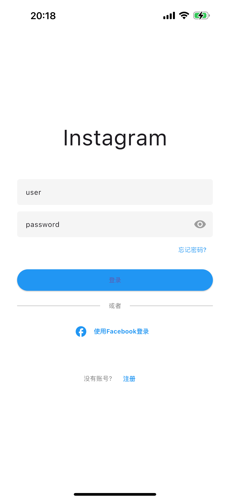

# Social App - Flutter 社交应用

基于 Flutter 构建的 Instagram 风格社交媒体应用，包含用户发帖、浏览、点赞和评论等核心功能。

## 应用截图


<br/>

<br/>

<br/>

<br/>


## ✨ 功能特性

- 用户注册与登录
- 发布图片/视频帖子
- 浏览关注用户的动态
- 点赞和评论功能
- 个人资料页面
- 搜索其他用户
- 本地数据缓存

## 🛠 技术栈

- **框架**: Flutter 3.x
- **状态管理**: Provider
- **网络请求**: http
- **图片加载**: cached_network_image
- **本地存储**: shared_preferences
- **UI 组件**: Material Design & Cupertino

## 🚀 安装运行

### 开发环境配置

1. 安装 Flutter SDK (>=3.0.0)
   ```bash
   # 下载并解压Flutter SDK
   git clone https://github.com/flutter/flutter.git -b stable
   export PATH="$PATH:`pwd`/flutter/bin"
   ```
2. 检查环境配置:
   ```bash
   flutter doctor
   ```
3. 克隆仓库:
   ```bash
   git clone https://github.com/your-repo/social-media-mobile.git
   cd social-media-mobile
   ```
4. 安装依赖:
   ```bash
   flutter pub get
   ```
5. 运行应用:
   ```bash
   flutter run
   ```

### 构建发布

- Android APK:
  ```bash
  flutter build apk --release
  ```
- iOS IPA:
  ```bash
  flutter build ipa --release
  ```
- Web:
  ```bash
  flutter build web --release
  ```

## 📁 项目结构

```
lib/
├── main.dart               # 应用入口
├── models/                 # 数据模型
│   ├── post_model.dart     # 帖子数据模型
│   └── user_model.dart     # 用户数据模型
├── screens/                # 页面组件
│   ├── home_screen.dart    # 首页
│   ├── login_screen.dart   # 登录页
│   ├── profile_screen.dart # 个人主页
│   ├── register_screen.dart # 注册页
│   ├── search_screen.dart  # 搜索页
│   ├── add_post_screen.dart # 发帖页
│   └── story_view_screen.dart # 故事浏览页
├── services/               # 服务层
│   ├── auth_service.dart   # 认证服务
│   ├── post_service.dart   # 帖子服务
│   └── story_service.dart  # 故事服务
└── widgets/                # 公共组件
    ├── post_card.dart      # 帖子卡片
    ├── story_circle.dart   # 故事圆圈
    ├── skeleton_loader.dart # 骨架屏
    ├── post_skeleton_card.dart # 帖子骨架卡片
    └── story_skeleton_loader.dart # 故事骨架加载器
```

## 📦 主要依赖

- provider: ^6.0.3
- http: ^0.13.4
- cached_network_image: ^3.2.0
- image_picker: ^0.8.5+3
- shared_preferences: ^2.0.15
- flutter_staggered_grid_view: ^0.6.2
- font_awesome_flutter: ^10.1.0
- timeago: ^3.2.2

## 🤝 贡献指南

欢迎贡献代码！请遵循以下步骤：

1. Fork 项目仓库
2. 创建你的分支 (`git checkout -b feature/your-feature`)
3. 提交修改 (`git commit -m 'Add some feature'`)
4. 推送到分支 (`git push origin feature/your-feature`)
5. 创建 Pull Request

## 🐛 问题反馈

如发现任何问题，请通过以下方式反馈：

- 在 GitHub Issues 中创建新问题
- 邮件联系: your-email@example.com

## 📝 许可证

MIT © 2025 Your Name
